# Assignment 1 - Prokudin-Gorskii's Photos of Russia


## Overview

Sergey Prokudin-Gorskii was a Russian photographer who is known for his pioneering work in color photography of early 20th-century Russia.

His work involved taking three different grayscale photographs of the same subject, each through a different color filter: blue, green and red. 

With today's technology, we can use each image trio as a separate color channel to recreate a full-color picture.


## Naive Implementation

The photographs are presented stitched together in one big, vertical, grayscale image. 

The naive approach is to read this image, horizontally crop the 3 separate images, use them as the 3 RGB channels for a color image.

Prokudin-Gorskii's photographs were taken in the order blue, green, and red, so we have to keep that in mind when composing the RGB image.

The code related to this implementation is labeled in the main script as "% Naive approach".

The results aren't that good, as shown below, and we'll try a better approach.


## Alignment

Naturally, as Prokudin-Gorskii had to take three different photographs, many things may have happened that would result in the images becoming misaligned. If a subject or the camera equipment moves, color glitches in the final RGB image will occur because the RGB channels become misaligned.

To measure the alignment between two images, we calculate the sum of square differences (SSD) between two images. For example, to calculate the SSD of the two matrixes below:

```
A = [1 2]    B = [7 8]
    [3 4]        [6 5]
```

We proceed like this:

```
ssd(A, B) = sum((B - A)^2) = 

= sum( [(7-1)^2  (8-2)^2] )
     ( [(6-3)^2  (5-4)^2] )

= sum( [6^2  6^2] ) = sum( [36 36] )
     ( [3^2  1^2] )      ( [9  1 ] )

= 36 + 36 + 9 + 1

= 82 
```

It is likely that when two plates are aligned, their SSD is minimized.

So, we use the SSD as the performance measurement of a certain plate alignment. 

The blue plate will not be shifted around. Instead, the red and the green plates will be shifted. The SSD between the red and blue plates, and between the green and blue plates, is what will guide us to the best alignment.

What happens to the edge pixels when the plates are shifted? In our implementation, we use Matlab's circshift function to shift the matrixes. This means that the right-most pixel will become the left-most when shifting by 1 pixel to the right.

A result of this is that the SSD in the wrapped regions becomes an inaccurate measure. To remedy this, we will disregard the border of the image when measuring the SSD.

A constant, `max_shift`, indicates the maximum percentage of the image that will be shifted. For example, with `max_shift = 0.05` and an image 100x200, we will try all possible shifts in the range `[-5..5, -10..10]`.

The SSD calculation will, then, disregard the 5 leftmost and rightmost pixels, as well as the 10 upmost and downmost pixels. This has the side-effect of disregarding the black and white artifacts that result from the digitalization of the images, which is a good for the purpose of this analysis.


### Complexity

This implementation works on small images, where a 5% shabbierift is just a range of 20 pixels in each direction.

But when images are large, a 5% shift means 180 pixels in each direction.

More formally, we have in our hands a complexity of O(n^2), where n is the width or height of the image.

Many smarter approaches are possible:

* Perform a predetermined number of shifts, equally divided among the total number of pixels. For example, 20 jumps would mean we jump 18 pixels every shift. This brings the algorithm to constant time.

* Use gradient descent in order to find a local minimum for the SSD function.

* Sample no-shift then all the 4 possible maximum shifts. From there, decide where to sample next, and so on, until reaching a local minimum. 

We decided to implement the 1st approach described. For this, we added a new constant, `shift_pts`, to be passed to the alignment function. This will determine how many pixel points in each direction will be sampled.


## Results

The following sets of images each represent an original tri-pallete image, the color image obtained using the naive approach, and the color image obtained using the shift approach measured by SSD.

| Image #  |  Original           |  Naive           | SSD               |
|:--------:|:-------------------:|:----------------:|:-----------------:|
| 1        | 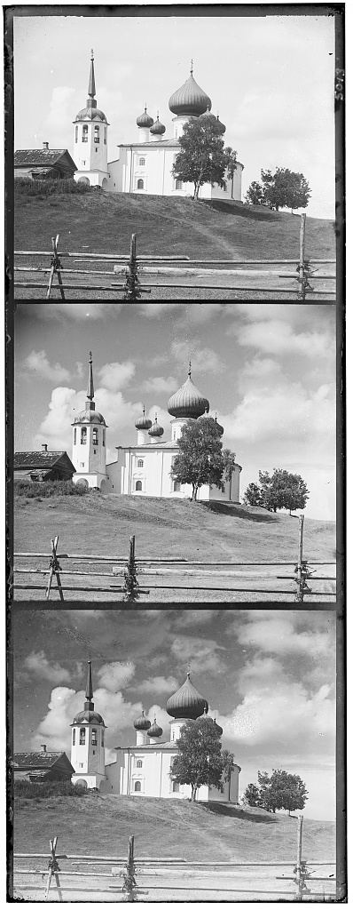 | 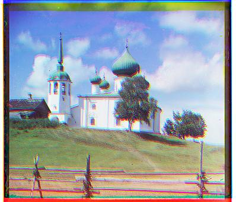 | 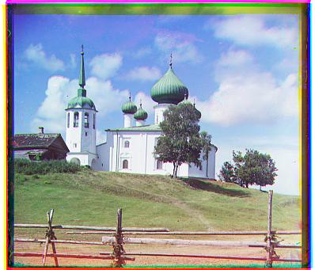 |
| 2        | 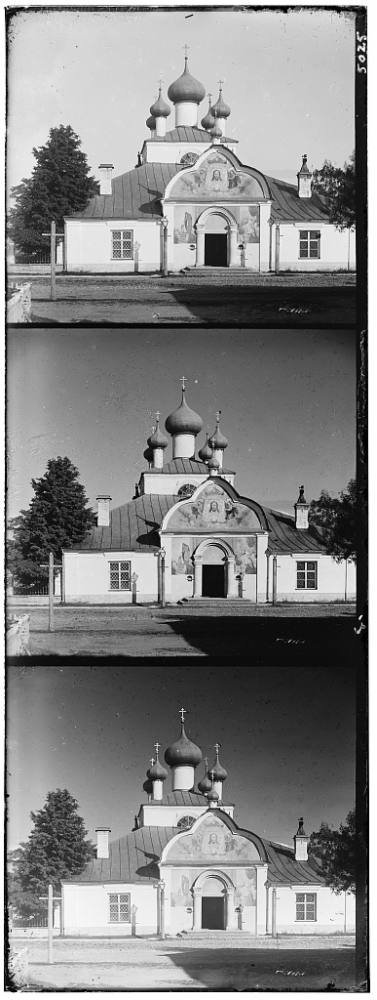 | 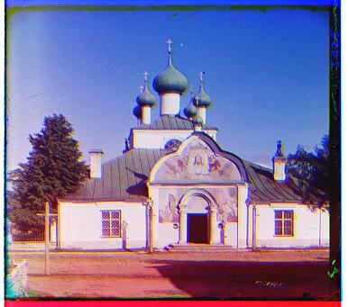 | 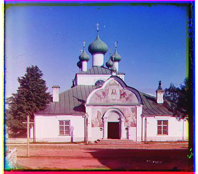 |
| 3        | 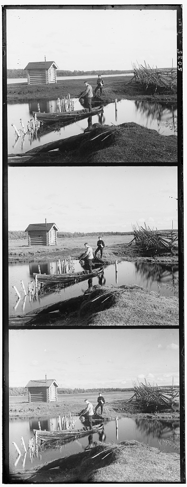 | 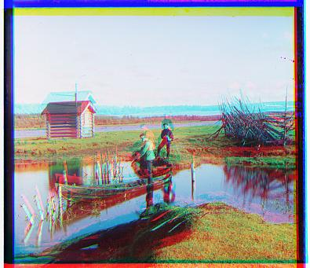 | 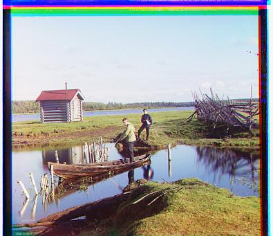 |
| 4        | 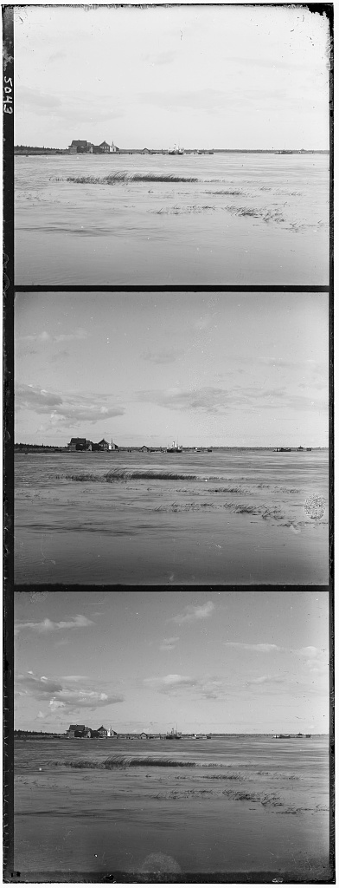 |  | 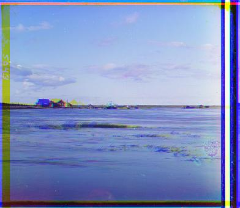 |


## Code

The code is in the `src` folder.

* `main.m` contains the constants that you should modify if you want to use another image. By default, it looks for folders in the `img` folder, so if you want to use a new image, you should place it in a folder there.

* `crop_center` takes an image and a percentage and crops out the border. Giving it a 100x100 image and a 0.1 ratio will make it output a 80x80 image.

* `ssd.m` is an implementation of SSD. Uses `crop_center` to disregard borders.

* `im_align` takes two images and outputs a shifted version of the second image so that the SSD between them is minimal. This does most of the work.
