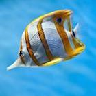
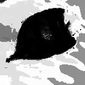
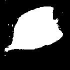
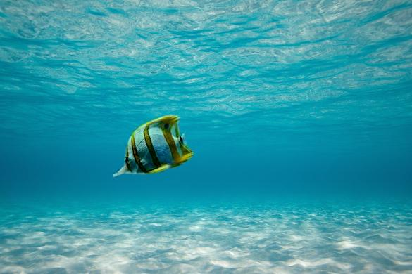

# Assignment 2 - Image Composition

# Part 1

## Overview

Throughout the lecture we will be referencing to the
following two images as `src` and `dst`, respectively.

Our objective is to seamlessly copy the fish from `src` into `dst`.


Please note that the fish image was adjusted so that it has the same dimensions
as the underwater image. This facilitates code and calculations.


## Binary Mask and Pixel Copying

In order to insert part of the source image into the destination image,
we need a binary mask.  
The binary mask determines which pixels get copied over from `src` to `dst`.

The example below illustrates the use of a binary mask containing
a rectangular zone with `1`-valued pixels, and the rest being `0`-valued.

The code for this is found in `src/simple_binary_mask.m`.


## Alpha Blending

A slightly better approach is to use alpha blending.

With alpha blending, values in the mask range from 0 to 1. A value of 0 means
we take the pixel from `dst`, a value of 1 means we take it from `src`, and any other
value means we take proportional amounts the pixel from `src` and `dst`.

We'll center a circle around the fish. The mask inside this circle will have values
greater than 0, linearly scaling from 0 on the edges, to 1 on the center.

The code for this is found in `src/simple_alpha_blending.m`.


## Toy Problem

Proceeded as described. Was able to recover image.

Respectively, original and recovered:


The code for this is found in `src/toy.m`.


## Poisson Blending

(Note: images here were resized to 30%.)

This is gradient domain fusion using poisson blending.

The result image is obtained from a least squares problem, represented by the following equation:

```
A x = b
```

Where `A` is a `N x N` matrix (`N = width * height`), and `b` and `x` are a `N`-sized column vectors.

`A` is called the coefficients matrix, `x` is the output image, and `b` is the desired gradient matrix.

For pixels outside the masked region, the output pixel is simply equal to the destination matrix.
For these, the corresponding row in the matrix A is the same as in the identity matrix, and the
corresponding value in the vector b is simply the same pixel as the destination image.

However, for pixels inside the masked region, it gets a little more complicated. The output pixel 
depends on the neighbors. Specifically, we wish to satisfy the following equation:

```
4 * x(i,j) - x(i+1, j) - x(i-1, j) - x(i, j+1) - x(i, j-1) = b(i,j) = grad(src, i, j).
```

We express this equation by filling the appropriate cells in the coefficient matrix with 4 and -1, 
and the corresponding value in `b` with the gradient at the same pixel in the source image.

We can then obtain `x` using `x = A \ b` in MATLAB, and reshape it into the original image
dimensions, to get our final result:


The code for this is found in `src/poisson_blending.m`.

## Code

The code is in the `src` folder.


# Part 2 - Graph Cuts

## Overview

Our objective is to find an image segmentation between background and foreground using graph cuts. 

Based on crude human input of the foreground or background, we can use a max-flow/min-cut algorithm
to obtain a graph cut that separates the foreground and the background.

We continue using the same base images as before, but now they are smaller for performance reasons.


## Maxflow

The maxflow function provided in this library takes as input two sparse matrices: a `A` `N x N` matrix defining the 
weights for the edges between each of the N pixels, and a `T` `N x 2` matrix defining weights between each
pixel and the source, and each pixel and the sink. 

These matrices actually represent a graph where each pixel is connected to its 4 neighbors, and all pixels
are connected both to the source and to the sink.


## Edges between a pixel and a neighbor pixel

For the weight of the edges between pixels, we calculated the square difference between the two pixels for
each color value and summed them.

Also, the weights are adjusted so they fit in the range of 0 to 1.


## Edges between a pixel and the source or the sink

We want these edges to represent the probability that a pixel belongs to the foreground (source) or
to the background (sink).

We construct histogram bins for the foreground and for the background, with 8 different bins, with the `histc` function.  
The histograms are smoothed by the `smooth` function, with a window width of 3.  
Finally, we adjust so that the values are between 0 and 1.

Then, for each pixel in the image, we find its respective bin in each of the histograms, and map to the value stored. The product of these 3 values (for the 3 color channels) makes up the weight between the pixel and the foreground/background. As always, we scale it to between 0 and 1.


## Finding the graph cut

Now, it is a matter of executing the library to find the graph cut and then use it as a mask for the
code in Part 1.


## Results

The graph cut was performed on this fish, using this manual mask.




We can look at the values in `T`, representing the weight between each pixel and the source/sink.




The graph cut solution found is represented by this mask:



Finally, using Poisson blending to blend that into the greener sea image, we get this result.




## Code

The code is in the `src/maxflow` folder. All files in it are from a MaxFlow library by Dr. Wittman, found [here](http://www.math.ucla.edu/~wittman/Fields/).

The implementation discussed here resides in the file `part2.m`. 