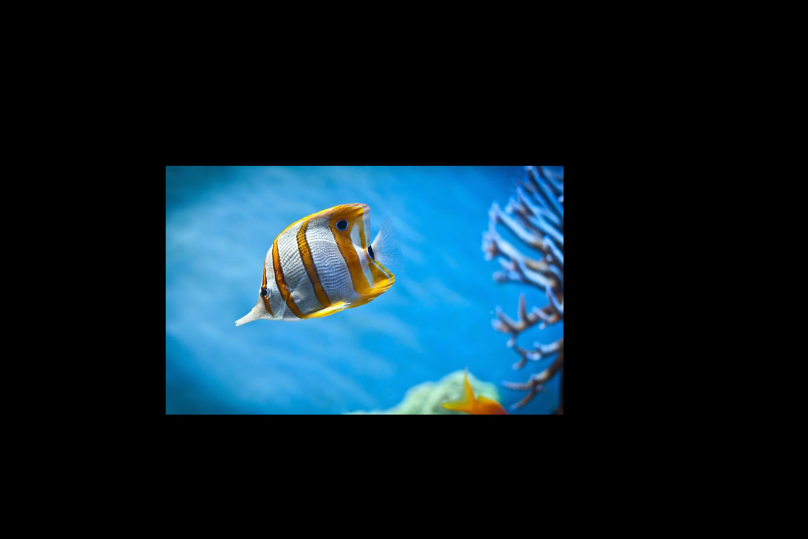
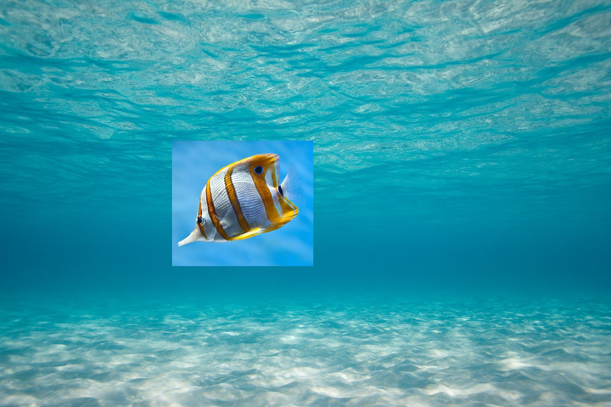
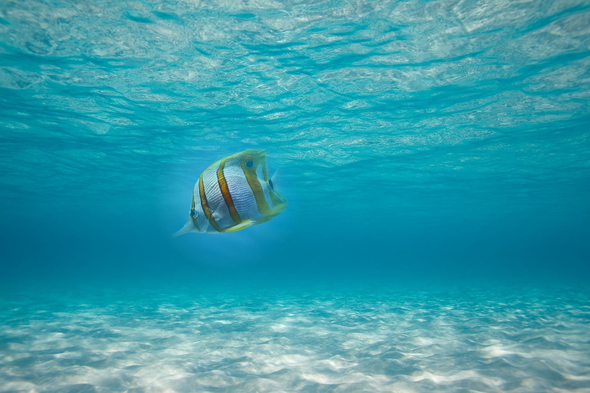

# Assignment 2 - Image Composition


## Overview

Throughout the lecture we will be referencing to the
following two images as `src` and `dst`, respectively.

Our objective is to seamlessly copy the fish from `src` into `dst`.




Please note that the fish image was adjusted so that it has the same dimensions
as the underwater image. This facilitates code and calculations.


## Binary Mask and Pixel Copying

In order to insert part of the source image into the destination image,
we need a binary mask.  
The binary mask determines which pixels get copied over from `src` to `dst`.

The example below illustrates the use of a binary mask containing
a rectangular zone with `1`-valued pixels, and the rest being `0`-valued.

The code for this is found in `src/simple_binary_mask.m`.




## Alpha Blending

A slightly better approach is to use alpha blending.

With alpha blending, values in the mask range from 0 to 1. A value of 0 means
we take the pixel from `dst`, a value of 1 means we take it from `src`, and any other
value means we take proportional amounts the pixel from `src` and `dst`.

We'll center a circle around the fish. The mask inside this circle will have values
greater than 0, linearly scaling from 0 on the edges, to 1 on the center.

The code for this is found in `src/simple_alpha_blending.m`.




## Poisson Blending

(Note: images here were resized to 30%.)

This is gradient domain fusion using poisson blending.

The result image is obtained from a least squares problem, represented by the following equation:

```
A x = b
```

Where `A` is a `N x N` matrix (`N = width * height`), and `b` and `x` are a `N`-sized column vectors.

`A` is called the coefficients matrix, `x` is the output image, and `b` is the desired gradient matrix.

For pixels outside the masked region, the output pixel is simply equal to the destination matrix.
For these, the corresponding row in the matrix A is the same as in the identity matrix, and the
corresponding value in the vector b is simply the same pixel as the destination image.

However, for pixels inside the masked region, it gets a little more complicated. The output pixel 
depends on the neighbors. Specifically, we wish to satisfy the following equation:

```
4 * x(i,j) - x(i+1, j) - x(i-1, j) - x(i, j+1) - x(i, j-1) = b(i,j) = grad(src, i, j).
```

We express this equation by filling the appropriate cells in the coefficient matrix with 4 and -1, 
and the corresponding value in `b` with the gradient at the same pixel in the source image.

We can then obtain `x` using `x = A \ b` in MATLAB, and reshape it into the original image
dimensions, to get our final result:


## Results

The following sets of images each represent an original tri-pallete image, the color image obtained using the naive approach, and the color image obtained using the shift approach measured by SSD.

| Image #  |  Original           |  Naive           | SSD               |
|:--------:|:-------------------:|:----------------:|:-----------------:|
| 1        |  |  |  |
| 2        |  |  |  |
| 3        |  |  |  |
| 4        |  |  |  |


## Code

The code is in the `src` folder.

* `main.m` contains the constants that you should modify if you want to use another image. By default, it looks for folders in the `img` folder, so if you want to use a new image, you should place it in a folder there.

* `crop_center` takes an image and a percentage and crops out the border. Giving it a 100x100 image and a 0.1 ratio will make it output a 80x80 image.

* `ssd.m` is an implementation of SSD. Uses `crop_center` to disregard borders.

* `im_align` takes two images and outputs a shifted version of the second image so that the SSD between them is minimal. This does most of the work.
