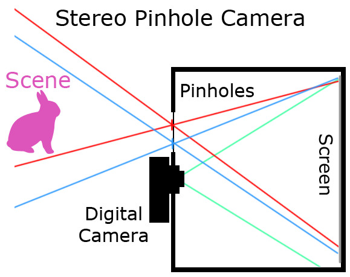
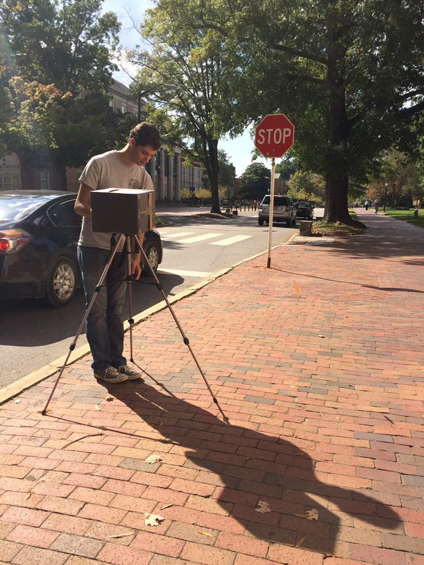
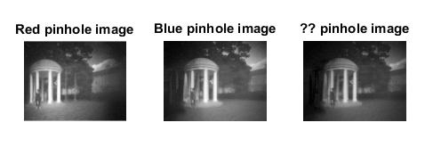
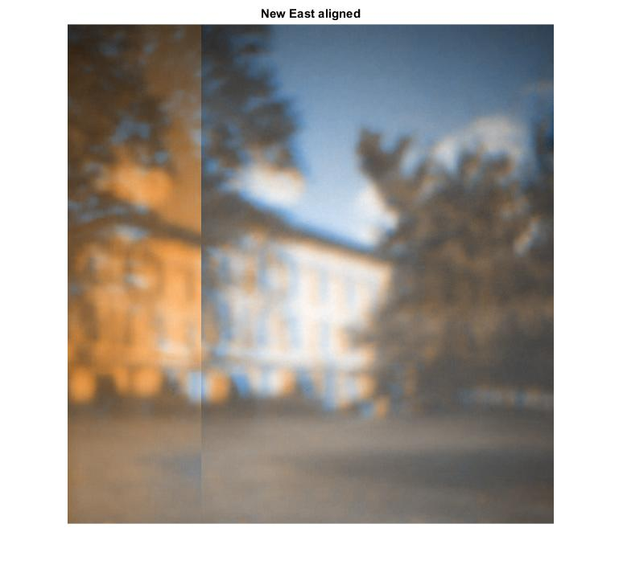
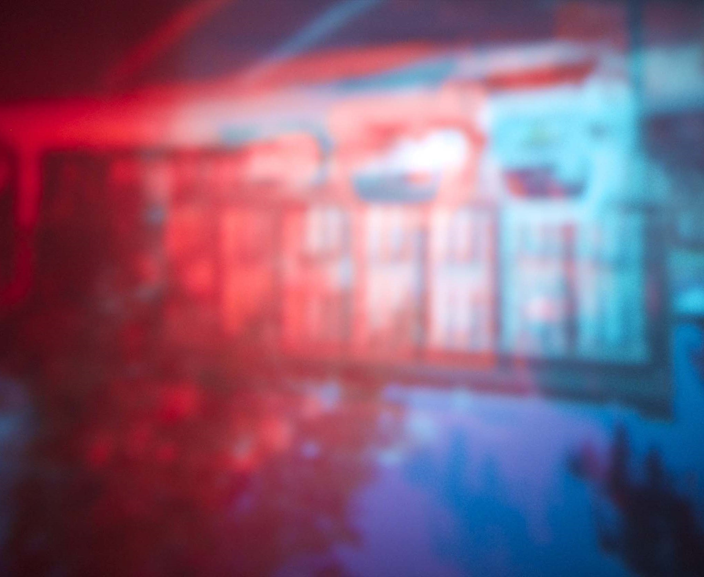
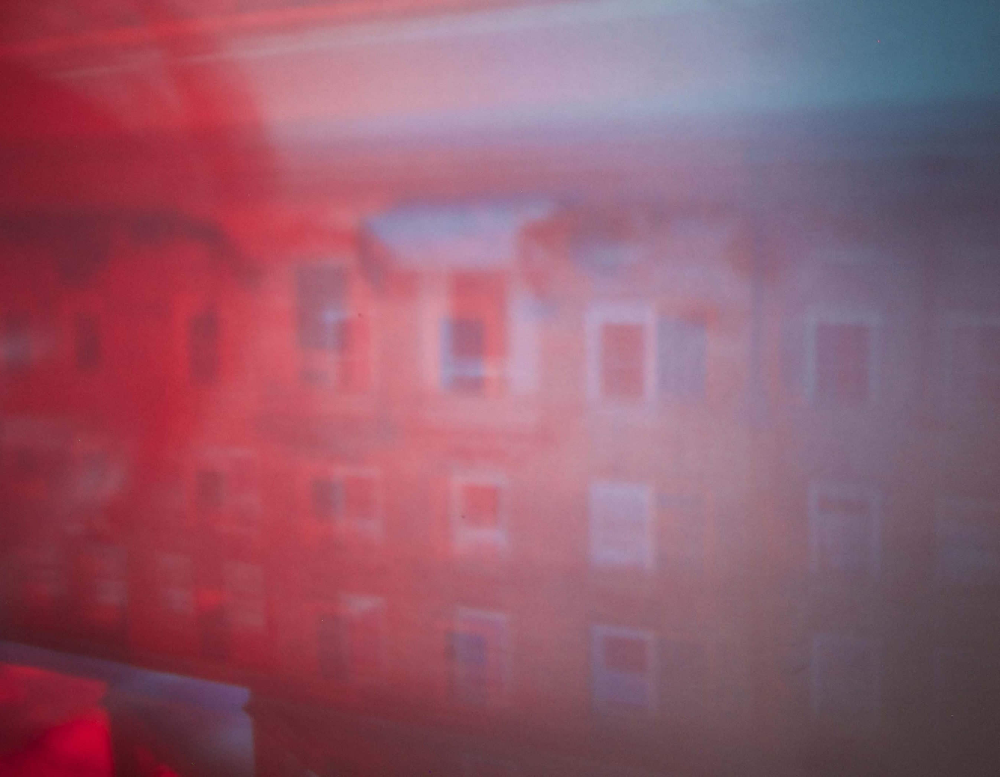
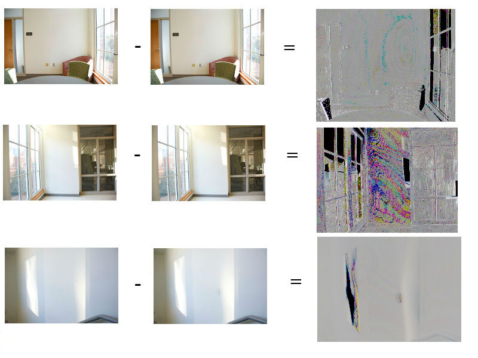

# Assignment 3 - Pinholes

In colaboration with Jennifer Baulier, Vance Miller and Sarah Rust.



## Part 1 - Stereo Pinhole Camera

### Setup

We started by building a stereo anaglyph pinhole camera. 

Basically, it is a black box with two pinholes. Each pinhole has a colored filter: red or blue. There is also a bigger hole where a digital camera was attached. This camera captured the image being projected into the white back wall of the box.



With this setup, we took pictures of various scenes throughout campus, each with three different exposure times.

### Preprocessing

The preprocessing involved cropping the relevant part of each image and inverting it vertically.

In Matlab, we grabbed the red and blue channels for each image. Each of these channels represents the filtered colors that came through each pinhole.



### Alignment

We use `ginput` to let the user select correspondent keypoints in each of the two channels. An arbitrary number of these, such as 3, let us shift the channels relatively to each other to achieve a minimum error.

### Disparity and Depth

We wanted to obtain the distance of each object in the scene to the camera -- the depth. By observing the disparity between two equal points in the two channels, and by taking into account the focal length and the baseline (distance between pinholes), we reach the following equation:

```
disparity = x - x' = baseline * f / z
```


### Results






### Code

Code was done in collaboration with the group and is available in `src/stereoImage.m`.

## Part 2 - Antipinhole

Using a digital camera mounted to a tripod, we could take sets of pictures in each scene (with several exposure times) in two situations: the normal scene, and then the scene with an occluder object.

This occluder object acts as an "anti-pinhole".

In theory, when subtracting one image from another and enlarging the differences, these differences will be due to the occluder object. If the light that the object blocks comes from a bigger object, like a building, we can make out the building in the difference image visualized.




### Code

Code was done in collaboration with the group and is available in `src/antipinhole.m`.

### Images

[Here](https://drive.google.com/folderview?id=0B_zRU2Dv83izcVU1NHVIMlJCZDg&usp=drive_web) are the images we collected for this assignment.