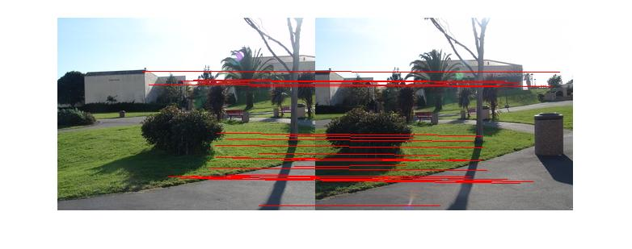
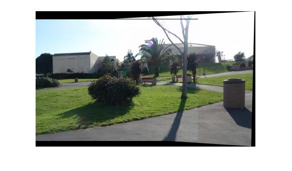
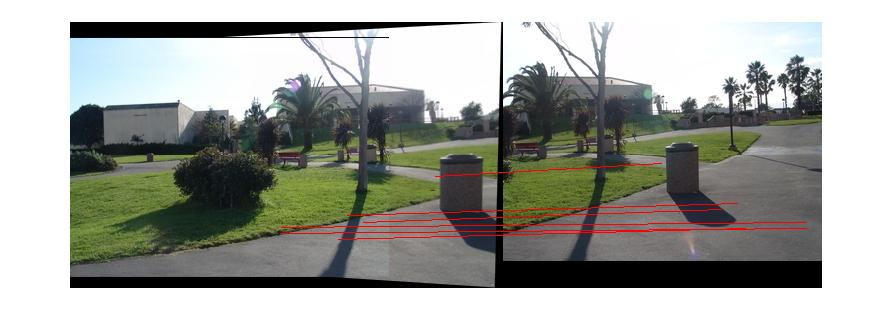
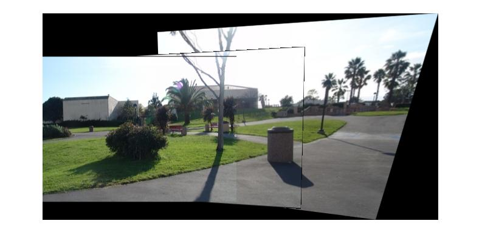
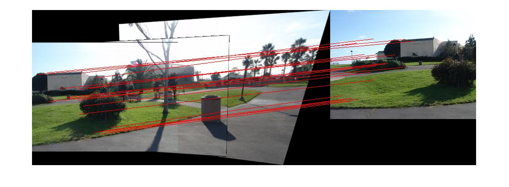
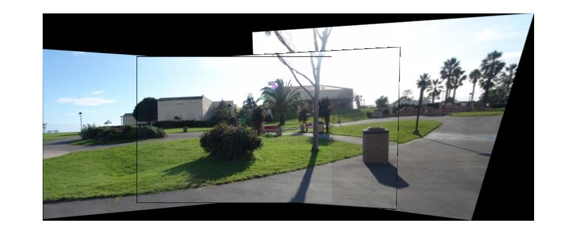
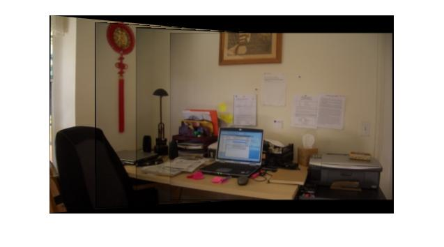
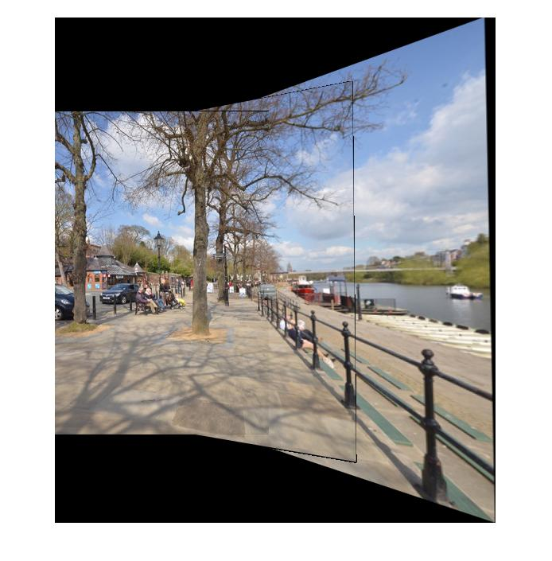

# Assignment 4 - Panoramas

This assignment explores the construction of panoramic images. We'll utilize sets of overlapping pictures to construct a final panorama image for each set. 

The first step is determining correspondending points between pairs of images, which can be done manually or automatically.

Then we can reconstruct a homography mapping between these two images, which will be used to map locations from one image to another.

Finally, we blend this pair together using the information obtained from the homography.

Doing this for all pairs in each set allows us to build the panoramas.

## Manual Correspondences

The most rustic way of specifying corresponding points is manually: a user must click on keypoints on each of the images. 

Due to high user error, this usually does not lead to a very good result.

Code for this is in the `get_correspondences` function.

## Automatic Correspondences

A better way is taking an algorithmic approach of obtaining corresponding keypoints in both images. 

An advantage of this approach is that we can much more quickly obtain more points than when entering them manually. Also, the results are better.

Code for this is in the `SIFT` function and was taken from an example on vlfeat.org.

## Homography

Now, with these pairs of points, we can reconstruct the homography. Recall that the homography allows us to map from one plane to the other. Because the different photographs were taken by keeping the camera in the same spot and rotating it, using homography for this makes sense.

The homography is obtained by solving a system of equations determined by the pairs of points, as seen on lectures. The `svd` function is used to help for this.

The implementation for this is in the `calculate_homography` function.

## Transformation

It is possible to obtain a transformation from the homography. This transformation maps corresponding points in the first image to the second. 

Evidently, the transformation can be used to link the two images together, because we can now map any points from one image to another.

In the file `code`, it's possible to see how all the different functions are composed together to stitch the panorama iteratively. This is a process that is done a pair at a time. We stitch the first and second images, getting an intermediate result, which is then stitched with the third image, and so on. On the intermediate results shown below, it is possible to see the keypoint correspondence on the 2nd step is actually done between a semi-panorama and the third image.

## Intermediate Results

## Results

## Source Code

The source code can be found in the `src` folder.

Dependency: the [VLFeat Library](http://www.vlfeat.org).

## Source Images

The source images are from [VisualSize](http://www.visualsize.com/mosaic3d/index.php).

I had taken pictures myself but found they were not good enough for the assignment. (It's a shame too, I took them in San Francisco.)